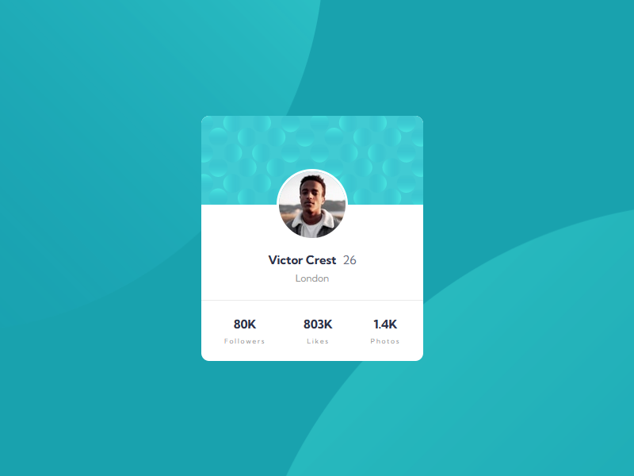

    

<h1 align='center'>Profile Card Challenge from Frontend Mentor</h1>

    <h2>
      <a href='https://profile-card-component-challenge-iota.vercel.app/'> Live Version at Versel </a>
    </h2>

## The Challenge
This was a very easy Challenge to do, after all, the proposal was to build a simple card, with only CSS and HTML. Even though it was pretty easy to do, it was really good for reinforcing the fundamentals of layout build, mainly in background image position concerns.

## Technology Used

    &nbsp; 
    &nbsp;
    &nbsp;
    &nbsp; 
    &nbsp;
    

## My Process

As usual I started by configuring the project folder and initializing the version control sistem and gitignore file. Then I structured all the content sematically in HTML and finishes configuring the styles through SASS pre-processor.

### What I learned
This was a very easy Challenge to do and despite not having learned anything very new, it was excellent to practice and strengthen the bases of layout, background position controls and web development with CSS and HTML only.

### Useful resources
- [W3School References](https://www.w3schools.com/) - References to CSS and HTML 
- [MDN References](https://developer.mozilla.org/en-US/) - References to CSS and HTML 
- [W3C Markup Validation Service](https://validator.w3.org/#validate_by_input) - HTML5 and CSS3 code compliance check

## Acknowledgments

I thank the entire Frontend Mentor team for making this platform available with such useful and important content for those who are starting to venture into this Web Developer career. Thank you very much (again) :v::slightly_smiling_face:

